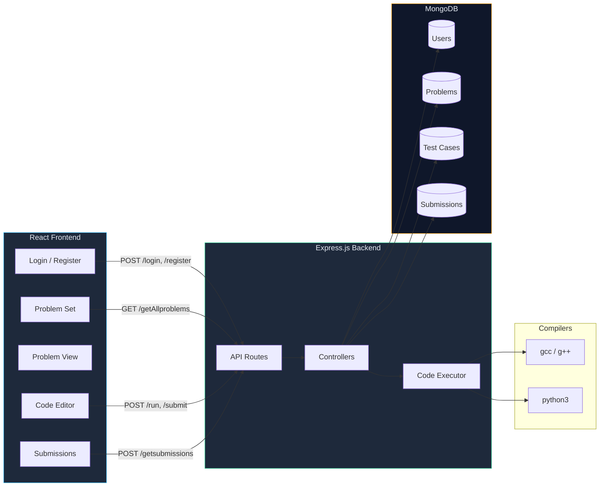
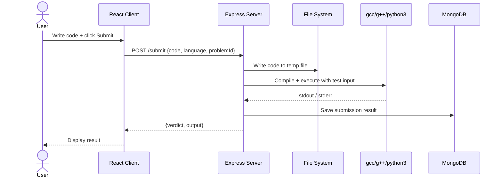

# Online Judge

**A competitive programming platform with code execution, problem sets, and submission tracking.**

Full-stack online judge supporting C, C++, and Python. Features user authentication, a problem library with test cases, an integrated code editor, and server-side code execution with input piping.

---

## Architecture



### Submission Flow



---

## Features

- **Multi-language support** — C, C++, and Python execution with automatic compilation
- **User authentication** — JWT-based login and registration with protected routes
- **Problem library** — Browse problem set with titles, difficulty, and descriptions
- **Integrated code editor** — Write and test code directly in the browser
- **Test case execution** — Server-side code execution against predefined inputs
- **Submission history** — Track all past submissions with verdicts
- **Run vs Submit** — Test against sample input (run) or validate against all test cases (submit)

---

## Quick Start

### Prerequisites

- Node.js 18+
- MongoDB (local or Atlas)
- `gcc`, `g++`, `python3` installed on the server

### Server

```bash
cd server
npm install

# Set up environment
# Ensure MongoDB is running (default: mongodb://localhost:27017)

# Start the server
node routes/routes.js
# or use nodemon for development
```

### Client

```bash
cd client
npm install
npm start
# Opens on http://localhost:3000
```

---

## API Endpoints

| Method | Endpoint | Description |
|--------|----------|-------------|
| `GET` | `/getAllproblems` | List all problems |
| `POST` | `/getstatement` | Get problem statement by ID |
| `POST` | `/login` | User login |
| `POST` | `/register` | User registration |
| `POST` | `/run` | Execute code against sample input |
| `POST` | `/submit` | Submit code against all test cases |
| `POST` | `/getsubmissions` | Get user's submission history |

---

## Project Structure

```
Online-Judge/
├── client/
│   ├── src/
│   │   ├── Components/
│   │   │   ├── Login.js          # Login form
│   │   │   ├── Register.js       # Registration form
│   │   │   ├── Problemset.js     # Problem listing
│   │   │   ├── Problem.js        # Problem detail view
│   │   │   ├── Ide.js            # Code editor
│   │   │   ├── Editor.js         # Monaco/CodeMirror editor wrapper
│   │   │   ├── Submissions.js    # Submission history
│   │   │   ├── Protected.js      # Auth guard (HOC)
│   │   │   ├── Nav.js            # Navigation bar
│   │   │   └── Probcard.js       # Problem card component
│   │   └── App.js                # Router setup
│   └── package.json
├── server/
│   ├── routes/
│   │   └── routes.js             # Express router definitions
│   ├── controllers/
│   │   ├── login_and_register.js # Auth logic
│   │   ├── getproblems.js        # Problem CRUD
│   │   ├── runcode.js            # Code execution (run)
│   │   ├── submitcode.js         # Code execution (submit)
│   │   └── getSubmissions.js     # Submission queries
│   ├── models/
│   │   ├── user.js               # User schema
│   │   ├── prob.js               # Problem schema
│   │   ├── testcase.js           # Test case schema
│   │   └── submission.js         # Submission schema
│   ├── executeFile.js            # C/C++/Python compiler interface
│   ├── codes/                    # Temp directory for code files
│   ├── db.js                     # MongoDB connection
│   └── package.json
└── README.md
```

---

## Tech Stack

| Component | Technology |
|-----------|-----------|
| Frontend | React, React Router, JavaScript |
| Backend | Node.js, Express.js |
| Database | MongoDB, Mongoose |
| Auth | JWT (JSON Web Tokens) |
| Code Execution | Child process (`gcc`, `g++`, `python3`) |
| Editor | Browser-based code editor |

---

## Supported Languages

| Language | Compiler/Runtime | Extension |
|----------|-----------------|-----------|
| C | `gcc` | `.c` |
| C++ | `g++` | `.cpp` |
| Python | `python3` | `.py` |

---

## Contributing

1. Fork the repository
2. Create a feature branch: `git checkout -b feature/my-feature`
3. Commit with conventional commits
4. Open a pull request against `main`

---

## License

MIT
